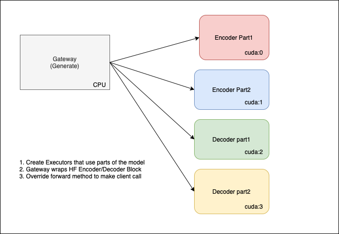

# Flan-Distributed
Distributing Flan Model using multiple-GPUs in Jina Ecosystem, This is dedicated to the Flan LLM family 
so you can change the model name to any model within the same family depending on your GPU capacities

<p align="center">

</p>


## 💾 Installation

```bash
pip install -r requirments.txt
```

## 🚌 Usage

### Specify your device_map

Encoder and Decoder blocks contain each 24 layers. According to your available GPUs
you can specify which layers go to which GPU. In my case I have 3 GPUs so every 8 layers 
go to one GPU. 

```python
config = {
    'device_map': {
        0: list(range(0, 8)),
        1: list(range(8, 16)),
        2: list(range(16, 24)),
    }
}
```

### Start the server 

```python
from jina import Flow
from distributed_flan.executor.encoder import EncoderExecutor
from distributed_flan.executor.decoder import DecoderExecutor
from distributed_flan.llms_distribution import MyGateway

flow = (
    Flow()
    .config_gateway(
        uses=MyGateway,
        port=12349,
        protocol='http',
        timeout_ready=-1,
        uses_with={'model_name': "google/flan-t5-xl"},
    )
    .add(
        uses=EncoderExecutor,
        uses_with={
            'model_name': "google/flan-t5-xl",
            'device_map': {
                0: list(range(0, 8)),
                1: list(range(8, 16)),
                2: list(range(16, 24)),
            },
        },
        port=12346,
    )
    .add(
        uses=DecoderExecutor,
        uses_with={
            'model_name': "google/flan-t5-xl",
            'device_map': {
                0: list(range(0, 8)),
                1: list(range(8, 16)),
                2: list(range(16, 24)),
            },
        },
        port=12347,
    )
)
with flow as f:
    f.block()
```

### Make a request
```python
import requests

# Set up the payload with the prompt as a query parameter
payload = {
    'input_text': "Translate the following English text to French: 'Hey, how are you?'"
}

# Make the request
response = requests.get('http://localhost://12348/generate', params=payload)
```
---

